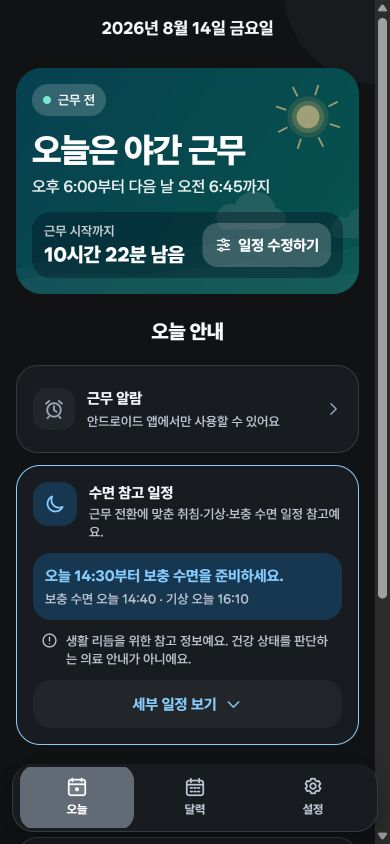
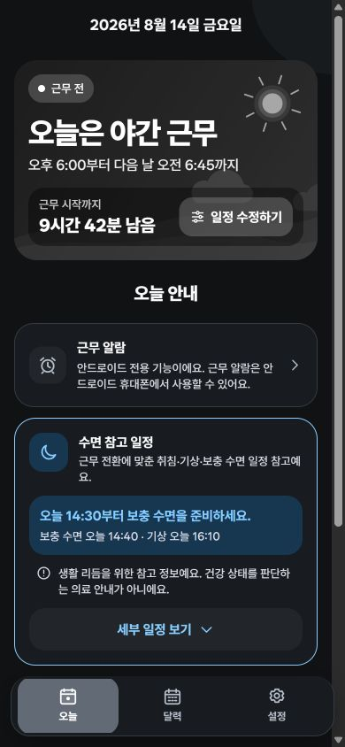
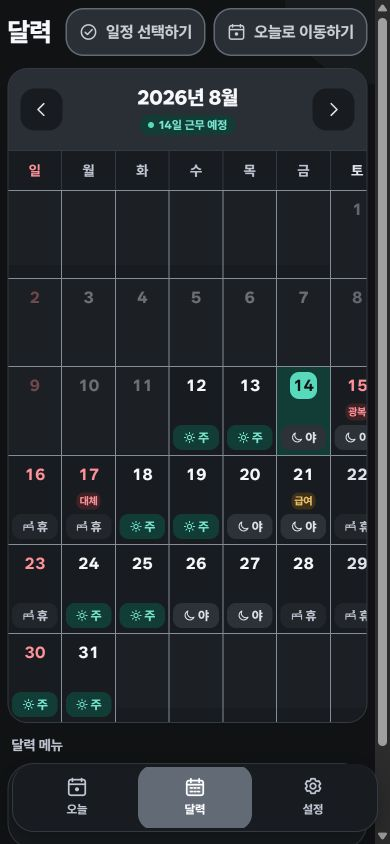
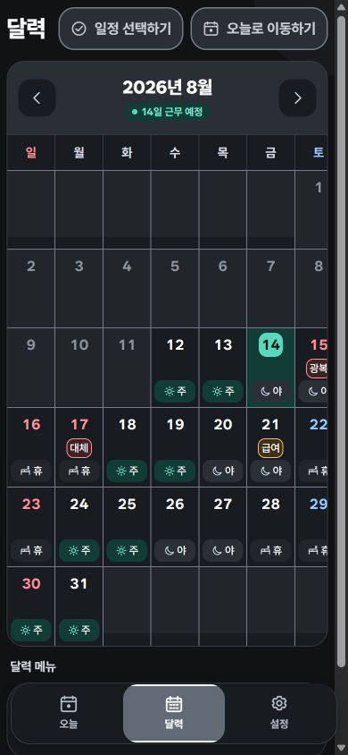
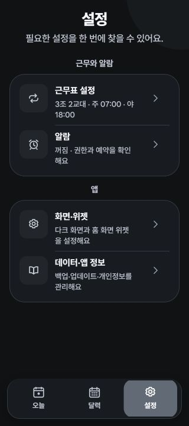
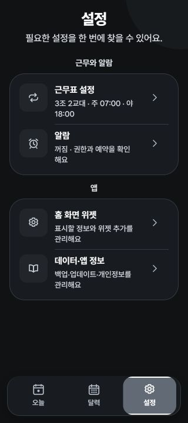
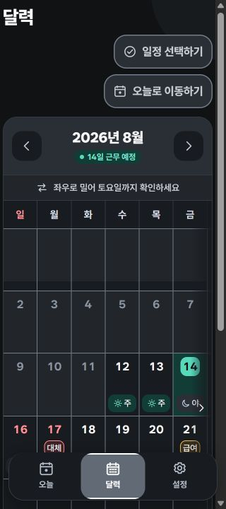

# 알람표 V03 디자인 QA

## 기준과 환경

- 시각 기준: V02 로컬 웹 화면과 사용자가 승인한 V03 계획
- 구현 기준: Expo Web 로컬 미리보기 `http://localhost:8081`
- 상태: 2026년 8월 14일, 3조 2교대 예시, 다크 전용
- 뷰포트: 390×844 CSS px 및 320×720 CSS px, 글자 배율 100%
- 기기 픽셀 밀도와 TalkBack은 웹 미리보기가 대신할 수 없어 V03 Play 설치본 실기기 QA로 남김

## 비교 기록

### 오늘 · 390×844

| V02 기준 | V03 구현 |
| --- | --- |
|  |  |

- 히어로 배경을 청록 그라데이션에서 `#181B1F → #22262B` 회색조로 바꿈.
- 제목·시간·설명 글자를 역할별 primary/secondary/tertiary 색으로 분리함.
- 근무 종류와 수면 안내의 의미색은 작은 배지·아이콘·표시 영역에만 남김.
- 주요 제목과 카드 설명의 대비와 훑어보기 속도가 기준 화면보다 개선됨.

### 달력 · 390×844

| V02 기준 | V03 구현 |
| --- | --- |
|  |  |

- 주간·야간·휴무·급여·공휴일을 글자와 배지 외곽으로도 구별할 수 있음.
- 토요일은 야간 의미색과 분리한 `#9AC7FF`를 사용함.
- 급여일은 `급여`, 예상일은 `급여*`, 공휴일 중복은 `급` 또는 `급*` 표식으로 표시함.
- 선택 경계는 비텍스트 대비 3:1 이상인 조작 경계 색을 사용함.

### 설정 · 320×720

| V02 기준 | V03 구현 |
| --- | --- |
|  |  |

- 첫 화면을 `근무표 설정`, `알람`, `홈 화면 위젯`, `데이터·앱 정보` 네 항목으로 유지함.
- 조작할 수 없는 테마 카드와 개발자 섹션을 노출하지 않음.
- 320px에서도 48dp 터치 목표를 유지하며 설명 문구가 잘리지 않고 줄바꿈됨.

### 좁은 달력 · 320×720

- 달력 본문만 짧게 가로 탐색하도록 하고 요일 헤더를 함께 이동시킴.
- 가장자리 단서와 `좌우로 밀어 토요일까지 확인하세요` 힌트를 제공함.
- 날짜 터치 영역을 줄이지 않았으며, 토요일 열은 가로 이동으로 접근 가능함.

## 수정 이력

1. 퍼플 강조색을 다크그레이·화이트 중심 팔레트로 전환함.
2. 회색이던 일반 본문을 더 밝은 설명 글자로 올리고 비활성 글자를 별도 토큰으로 분리함.
3. 공통 `StatusBadge`와 `AppText tone` 계약을 도입함.
4. 달력의 급여·공휴일 중복 표현, 토요일 색, 320px 탐색 단서를 보정함.
5. 설정 구조를 네 항목으로 정리하고 로고·아이콘·배너를 동일한 흑백 원본에서 파생함.

## 최종 판정

- 웹 시각 QA: 통과
- 320px 핵심 흐름: 통과
- 회색조 정보 구분: 통과
- 정적 대비 계약: 통과
- 남은 검증: Android 12~16 실기기의 글자 130/150/200%, TalkBack 단일 낭독, 원형·스쿼클 마스크, 스플래시, Samsung 성능 p95 및 Play 설치본 스크린샷

